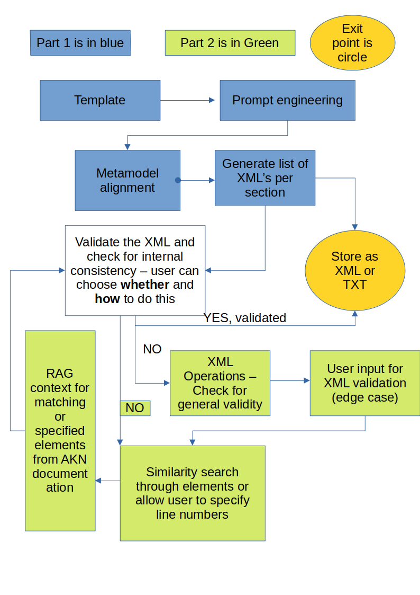

# Schematise (formerly "Complianalyse")
### Submission to [The Fifth Elephant's Open Source AI Hackathon](https://hasgeek.com/fifthelephant/open-source-ai-hackathon/)

### Overview 
Schematise is an LLM enabled XML generator for Indian statutes and laws in the Akoma Ntoso and LegalRuleML schemas. It utilises certain examples as few shot prompts and RAG prompting with the different meta models as context. It makes use of prompt engineering and RAG prompting to generate XML, with the option for users to provide input regarding which places need further tweaking in a Human in the Loop approach. The program is available as an open-sourced streamlit app, and is built on the LangChain framework to allow users to choose between OpenAI or Llama2. The latter makes it possible to generate datasets for fine tuning, which OpenAI restricts. 

### License 
The application and source-code is distributed under an Affero GPL license, according to which any modification or redistribution (even if as a web-app) must be redistributed on the same terms. 

### Features
1) Automatic conversion to LegalDocML and LegalRuleML schemas.
2) Metamodel alignment for LegalRuleML generated schema.
3) Similarity comparison for two sections of the generated schema.
4) Choice between OpenAI (GPT3.5 turbo) or local deployment of Llama2-7b-chat via Hugging Face Transformers library. 

### Requirements for running the Streamlit version (hosted at https://schematise.streamlit.io):

1. A valid OpenAI API key.
2. Either an IndianKanoon API key, or,
   A CSV file with each section title and section on a new row. Format for the same is available at the [following link (click here to view)](https://raw.githubusercontent.com/sankalpsrv/Schematise/dev/fullsections.csv).
3. A web-browser.
4. A file editor (optional).

### How to run locally – Streamlit app:

1. Change directory to "Streamlit" and install the requirements (preferably in a conda shell):
    1. First run `conda env create -n condaenvironmentname`; 
    2. and after that activate the conda environment using `conda env activate condaenvironmentname`;
    3. then run `conda install pip`
    4. Lastly, run `pip install -r requirements.txt`
2. Run `streamlit run Schematise.py`
3. Clear cache when needed (such as to re-generate XML for the same sections)

### How to run locally – Llama-2-7b-chat on GPU:

1. Change directory to "LocalWorkflow" and install the requirements (preferably in a conda shell) 
    1. First run `conda env create -n condaenvironmentname`; 
    2. and after that activate the conda environment using `conda env activate condaenvironmentname`; 
    3. then you can install the package dependencies using `conda env update --file condaenvironment.yml `.
2. Replace “fullsections.csv” with the file 
3. Specify your model from HugingFace in Line 54 of model.py - I use GPTQ quantisation because of the larger context window. 
4. Run python main.py 

### How to use the Streamlit app:

##### Main-page:

1. Choose whether you want to upload the CSV file or proceed with an IndianKanoon URL.
2. If selected “Upload”, put a CSV file in the format provided on the link in the app. For reference, see point number 2 of requirements. You can also leave blank to work with the default CSV, which is the E-Waste (Management) Rules, 2016.
3. Choose LegalDocML or LegalRuleML as the format you want the XML in. Only one is generated at a time. Metamodel can be applied for tweaking only if LegalRuleML is selected.
4. Enter the starting range and ending range as the rows you want the XML generated for, from the CSV.
5. Check the checkbox for viewing the dataframe to preview the rows you have selected from the CSV.
6. Choose OpenAI as the LLM. Llama2 support for the UI app is yet to come.
7. Click “Download XML generated” to get the XML generated in the format you have chosen as a “.txt” file. 

##### Metamodel page:

1. Choose which metamodel you would like to provide as context to the LLM to modify the LegalRuleML generated in accordance with. These are 7 of the metamodels chosen from the LegalRuleML core specification page. 
    1. Context
    2. Defeasible
    3. Deontic
    4. Legal Temporal
    5. Metadata actor
    6. Metadata jurisdiction authority
    7. Statement
2. After choosing, the metamodel is automatically generated.
3. Click “Download XML generated” to get the XML generated in the format you have chosen as a “.txt” file.
4. You can choose to opt for more tweaking, by choosing the option described in step 1 again. 

##### Similarity page:

1. Select two index numbers (starts with zero) that you want to check for similarities.
2. If both the XML fragments are well-formed, it will immediately present the similarities between the different XML element tags and attributes.
3. If either XML fragment does not validate, then you will be provided the XML fragment along with the option to either upload or edit the XML. 
4. After editing, or uploading the XML fragment, you can download the edited XML. 

### FAQ:

1. Why “.txt” format for downloading the XML? 
   This format is chosen because the XML generated will have to be well formed and validated before it is stored as a “.xml” file. See “Similarity page” for more details. 
2. Why do I need to provide an IndianKanoon key?
   It is not necessary to provide an IndianKanoon key, you can proceed with an uploaded csv file in the format available at the [following link (click here to view)](https://raw.githubusercontent.com/sankalpsrv/Schematise/dev/fullsections.csv).
3. Why do I have to provide my OpenAI key?
   The Streamlit community cloud hosted version works with OpenAI. However, you can always use the local inferencing available on the [GitHub repository (click here to visit)](https://github.com/sankalpsrv/Schematise)
4. Why can metamodel only be used for “LegalRuleML”?
   This is because of the availability of a metamodel for LegalRuleML, which is not the case for LegalDocML. However, in the future version, identifiable aspects of the LegalDocML documentation with examples will also be added.
5. Why are only 7 of the metamodels used as context?
   The metamodels to be provided as context were chosen on the basis of their coverage of the concepts defined in the LegalRuleML core specification. You can view the paragraphs chosen as context in the file [“metamodels_combined” in the “Docs” folder](https://github.com/sankalpsrv/Schematise/blob/dev/Streamlit/Docs/metamodels_combined.txt) 
   The following metamodels were excluded:
   - “Alternative” – seeks to implement alternative interpretations, which does not occur as the LLM is not prompted for it;
   - “Rulemm” – contains distinct elements which appear to be mutually exclusive and without documentation in the LegalRuleML core specification;
   - “Source” – contains the elements for describing where the text has been ‘sourced’ from, which will require a specific input by the user;
   - “Upper” – contains the elements associated with comments passed, which is not something that the LLM is being prompted for.
   - “Wrapper” – contains enclosing XML elements only for various purposes and they do not pertain to a single  category of elements.
6. What is the similarity page for?
   It has been noticed that the XML which is generated through successive iteration through the CSV files can have an inconsistent representation of provisions in XML elements or attributes. In other words, similarly named elements and attributes are generated where an element or attribute should have had the same name as was for an earlier generated XML for a section. This page allows you to detect this similarity using Python’s [“TheFuzz” library’s Simple Ratio](https://pypi.org/project/thefuzz/). 

# Progress

### [Go to "dev" branch (click here) to view more frequent development updates](https://github.com/sankalpsrv/Schematise/tree/dev)

- Was able to test the few-shot learning in-context learning approach via LangChain and OpenAI. Due to token limits on LangChain, using a split approach was necessary.
- Nevertheless, was able to generate LegalRuleML code via this approach - [available in this notebook (click here)](https://github.com/sankalpsrv/Complianalyse/blob/main/LangChain_FewShot.ipynb)
- The test output generated for the entire Bio-medical Waste Rules is here - [testbmw.txt](https://github.com/sankalpsrv/Complianalyse/blob/main/src/testbmw.txt)
- This was generated using the script in the ["src" folder of this repository (click here)](https://github.com/sankalpsrv/Complianalyse/blob/main/src/main.py)
- Tested Llama through LangChain and AzureML Endpoints, found that it works via Azure, while LangChain presents some difficulties [click here to view notebook](https://github.com/sankalpsrv/Schematise/blob/main/Notebook-of-approaches/Llama2_AzureMl_CompletionsAPIAndChatAPI(1).ipynb)
- Tested Llama2-7b-chat on few shot prompting using the examples given in the [LegalRuleML documentation](https://github.com/sankalpsrv/Schematise/blob/main/Notebook-of-approaches/Llama_Documentation_Prompting.ipynb), found that it produces better output.
- Wrote a [set of functions that compare similarity scores for the XML file generated sequentially](https://github.com/sankalpsrv/Schematise/blob/main/Notebook-of-approaches/Similarity-XML-SimpleRatio.ipynb). This will be helpful for identifying places where there is overlap in case of Few-Shot Prompting.
- Wrote a [RAG approach using the metamodel and descriptions of schema](https://github.com/sankalpsrv/Schematise/blob/main/Notebook-of-approaches/Metamodel-RAG.ipynb)that can be used for tweaking LegalRuleML generated earlier.
- [Opened a dev branch](https://github.com/sankalpsrv/Schematise/tree/dev) - contains work on putting together the developed components. So far have uploaded the Azure Machine Learning Endpoints approach, will be adding more with local deployment.
- Tested various models and their quantisations for context windows, GPTQ quantised version accepts a larger context and the output is [uploaded in a notebook](https://github.com/sankalpsrv/Schematise/blob/main/Notebook-of-approaches/LocalLlama-LangChain.ipynb)
- Ported the entire app to Streamlit and [hosted it on their Community Cloud](https://schematise.streamlit.app). The code for this is in the ["streamlit" branch](https://github.com/sankalpsrv/Schematise/tree/streamlit)

### Ethical considerations

- App shall provide a disclaimer before executing and at the generated results in each case regarding the results not constituting legal advice.
- No user data will be sought or stored in any place. The database integration will store the inference results for each statute.

### LLMs being compared
HuggingFace's Transformers library will be made use of, in addition to Azure or any other comparable compute resources provider.

- Llama (useful because of its Grammars implementation)
 I have been able to generate similar output from Llama's 13b and 7b models via few-shot prompting. 
- GPT
I am using GPT3.5 for some idea testing and it has been delivering results consistently so far. I have shared these in my [notebook on the GitHub repository](www.github.com/sankalpsrv/Schematise/blob/main/Notebook-of-approaches/LangChain_FewShot.ipynb)

The following models will be considered later, if required
- Mixtral 7b instruct fine tuned
- BERT models
  - LegalBert (However, [this paper](https://www.sciencedirect.com/science/article/abs/pii/S0267364923000742) suggests that auto-encoding models perform lesser than autoregressive ones on this task)
  - InLegalBert (shown to perform better on Indian laws)

# TO-DOs

[Successful] Make a draft version of the app for review at the Hackday which will work on a representative set and generate compliances in Markdown/Text format.

[Unsuccessful] Find a teammember before 15th.

[TBD] Need to make a way to parse the templates that could be uploaded by the user.

[Ongoing] Update project page on hasgeek continuously. 

[Successful] Identify the correct chunking strategy for RAG. Share approaches as notebook.

[TBD] Use XML tools to validate and parse the XML generated by the LLM. 

[Successful] Test different LLMs described in the section above for their accuracy. Share results in separate folder as Jupyter Notebooks.

[Successful] Combine the different components into Part 1 - combined XML generation without validation

[Successful] Combine the different components into Part 2 - XML validation and metamodel alignment

[TBD] Create a modular set of classes to handle different options - Local and OpenAI

[TBD] Upload the models as fine-tuned models once satisfactory performance is achieved.

[TBD] Identify a way to benchmark or validate the performance of an LLM.

[Successful] Draft a disclaimer for the app to show users.

[Successful] Select copyright license.

# Roadmap

1. Develop a script that can take laws in text or PDF format and divide them by sections. 
  - This can include LLM based text-classification, however (see next point)
  - For a few standardised formats, this script should be able to do it without reliance on an LLM.
    - Need to explore to what extent an ANTLR serialisation can be developed for a few standard templates, and also whether it needs to be more dynamic than that.   
2. Implementing different LLM based text-generation approaches (list is indicative)
  - In-context learning for prompts that generate the LegalRuleML schema. This has already shown some results - [click here to see notebook that generated XML via prompt engineering](https://github.com/sankalpsrv/Schematise/blob/main/Notebook-of-approaches/Llama_Documentation_Prompting.ipynb)
  - Implement an approach that uses RAG, by processing the documentation provided for LegalRuleML. Currently looking at a way to implement 
  - LoRA adaptation using either HuggingFace, [Axolotl](https://github.com/OpenAccess-AI-Collective/axolotl) or Lit-GPT as outlined [here](https://cameronrwolfe.substack.com/p/easily-train-a-specialized-llm-peft).
  - Also will perform the training of a fine-tuned model on a custom-generated dataset, generated via an LLM model that allows for using its output for training (for e.g., OpenAI does not).
     - will use the dataset provided by Nyaaya-In as a way to fine-tune Llama2-7b-chat. Since this is provided under a Creative Commons ShareAlike license, I will create a separate branch for this approach. 
     - Alternatively, since In context learning has already shown some results, this will be used to create a fine-tuning dataset for some Environmental Laws (owing to the extensive compliance requirement there, which I have [previously researched on](https://sankalpsrv.in/2021/08/15/dissertation/).

3. **For fine tuning**:- Upload the models to huggingface and run validation tests for it on a repeated basis in order to identify whether further fine-tuning is required and to what extent.
   **For prompt engineering and fine-tuning approaches** - incorporate a way to verify the XML generated by the model, as also perform other XML level functions such as compacting and normalisation, ultimately for comparison.

4. Compare each of the approaches and select a default approach, as well as integrate each approach into the application.

5. Lastly, to save inference time, integrations with PostgreSQL/sqlite for the cached versions of laws will be stored in the working directory itself.
